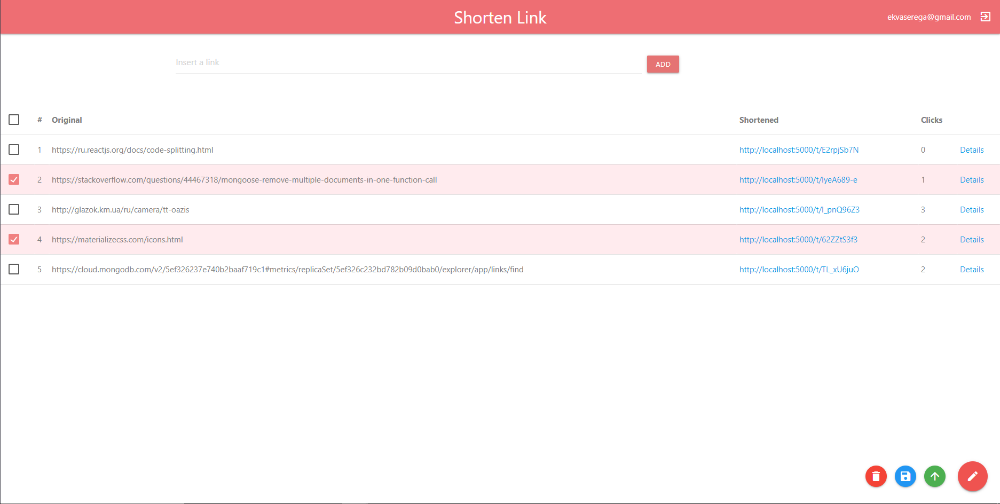

# ShortenLink

This is a test project focused on learning React and it's interaction with Node.js. This small app can shorten links (urls) and count clicks on it.
Thanks to Vladilen Minin, because it his idea. I continued work on it.

